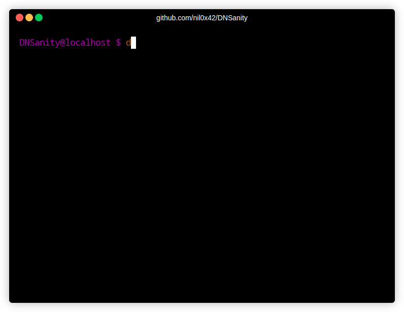

<h1 align="center">DNSanity :dart:</h1>

<h3 align="center">
    Quickly validate DNS servers at scale
    <a href="https://twitter.com/intent/tweet?text=DNSanity%3A%20validate%20massive%20lists%20of%20DNS%20resolvers%20at%20scale%20%28for%20recon%20%26%20DNS%20bruteforcing%29%20-%20by%20%40nil0x42&url=https://github.com/nil0x42/dnsanity">
      
    </a>
</h3>
<br>

<p align="center">
  <a href="https://github.com/nil0x42/dnsanity/blob/master/.github/workflows/tests.yml#L18">
    
  </a>
  <a href="https://github.com/nil0x42/dnsanity/actions/workflows/tests.yml?query=branch%3Amaster">
    
  </a>
  <a href="https://github.com/nil0x42/dnsanity/network/dependencies?q=ecosystem%3AGo">
    
  </a>
  <a href="https://app.codacy.com/gh/nil0x42/dnsanity/dashboard">
    
  </a>
  <a href="https://github.com/nil0x42/dnsanity/actions/workflows/codeql.yml?query=branch%3Amaster">
    
  </a>
</p>

<p align="center">
  <a href="https://codecov.io/gh/nil0x42/dnsanity">
    
  </a>
  <a href="https://qlty.sh/gh/nil0x42/projects/dnsanity">
    
  </a>
  <a href="https://x.com/intent/follow?screen_name=nil0x42" target="_blank">
    
  </a>
</p>

<div align="center">
  <sub>
    Created by
    <a href="https://twitter.com/nil0x42">nil0x42</a> and
    <a href="https://github.com/nil0x42/dnsanity/graphs/contributors">contributors</a>
  </sub>
</div>

<br>

* * * * * * * * * * * * * * * * * * * * * * * * * * * * * * * * * * *


### :book: Overview

**DNSanity** is a fast DNS resolvers validator, offering deep **customization**
and reliable **concurrency**.

- **Blazing-Fast**: Test thousand servers in parallel with **global & per-server rate-limiting**.  
- **Flexible**: Easily write your own template for custom validation.  
- **Reliable**: Automatic template re-validation before every usage.  

<a href="https://github.com/nil0x42/dnsanity/releases/latest"></a>
<br>

### :arrows_clockwise: Workflow

**1 – Template Validation**  
Run each template query against trusted DNS servers and ensure every answer matches the expected result.

**2 – Server Validation**  
Run the same queries on every candidate server.  
Reject any server that fails more checks than the allowed limit.


<br>

### :bulb: Quick start

```bash
go install github.com/nil0x42/dnsanity@latest   # go 1.21+ needed
dnsanity --help                                 # show help
dnsanity -list "untrustedDNS.txt" -o "out.txt"  # basic usage
```

<br>

### :card_index: Custom template

```bash
# <FQDN>             <EXPECTED-RESULT>                   <COMMENT>
cr.yp.to             A=131.193.32.108 A=131.193.32.109   # two specific A records
wiki.debian.org      A=* CNAME=wilder.debian.org.        # specific CNAME with any A record
dn05jq2u.fr          NXDOMAIN                            # invalid TLD: NXDOMAIN
invalid.com          SERVFAIL||NOERROR||TIMEOUT||FORMERR # allow an of these answers
lists.isc.org        A=149.20.*                          # A record matching pattern
app-c0a801fb.nip.io  A=192.168.1.251                     # specific single A record
retro.localtest.me   A=127.0.0.1                         # specific single A record
```
A template test *(line)* defines what a domain must return when resolved by a DNS server.
Create your template, and use it with `dnsanity -template /path/to/template.txt`  


<br>

### :mag: Options


### :factory: Under the Hood

**DNSanity** aims for maximum speed without sacrificing reliability
or risking blacklisting. Here’s the core approach:

- **Trusted Validation**  
  Before checking your untrusted servers, DNSanity verifies the **template**
  itself against trusted resolvers (e.g., `8.8.8.8`, `1.1.1.1`).
  This ensures your template is valid and consistent.
- **Test-by-Test Concurrency**  
  For each untrusted server, DNSanity runs tests sequentially in
  an efficient pipeline. Once a server accumulates more mismatches than
  `-max-mismatches` *(default 0)*, it’s dropped immediately,
  saving time & bandwidth.
- **Per-Server Rate Limit**  
  Use `-ratelimit` so you don’t overload any single DNS server.
  This is especially helpful for fragile networks or for preventing
  blacklisting on public resolvers.
- **Timeout & Retries**  
  If a query doesn’t reply within `-timeout` seconds, it fails.
  If `-max-attempts` is greater than 1, DNSanity can retry,
  up to the specified limit.

<br>

### :information_source: Additional Tips

- **Craft a Thorough Template**  
  A varied template (involving A, CNAME, NXDOMAIN, and wildcard matches)
  quickly exposes shady or broken resolvers.
- **Geo-Located Domains**  
  Beware that some domains (e.g., google.com) may return different IP addresses
  based on location. This might cause expected results to mismatch.
- **Fine-tune template validation step**
  `-trusted-*` flags allow fine-tuning specific limits for this step, which
  uses trusted server list (use `--help` for details)

<br>

### :star: Acknowledgments

- **[dnsvalidator](https://github.com/vortexau/dnsvalidator)** – for the original concept of verifying DNS resolvers.  
- **[dnsx](https://github.com/projectdiscovery/dnsx)** – inspiration for a fast, multi-purpose DNS toolkit.  
- **[miekg/dns](https://github.com/miekg/dns)** – the Go library powering DNSanity queries under the hood.

---

**Happy Recon & Hacking!**
